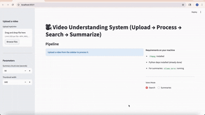

# 🎥 End-to-End Video Understanding System  
**Upload video → Process → Search → Summarize**

This project is a **full-stack, end-to-end video understanding system** that transforms long videos into **searchable, summarizable, and explorable knowledge** using **only open-source models and local inference**.

It demonstrates how to build a **real-world multimodal AI system** combining video processing, speech recognition, embeddings, vector search, and LLM-based summarization—wrapped in a clean interactive UI.

---

## What This System Can Do

- Upload videos (up to **2GB**)
- Automatically segment videos into meaningful moments
- Perform **semantic search** across video content
- Generate **human-readable summaries and timelines**
- Play precise video clips for search results and summary chunks

---

## Key Features

### Video Understanding Pipeline
- Video ingestion & metadata extraction
- Audio extraction
- Speech-to-text using **faster-whisper**
- Moment segmentation with adaptive windowing
- Thumbnail extraction
- Text embeddings (CLIP)
- Image embeddings (CLIP)
- Multimodal embedding fusion
- FAISS-based semantic indexing

### Semantic Search
- Natural-language search across video moments
- Ranked results with:
  - timestamps
  - transcript snippets
  - thumbnails
  - playable video clips

### Summarization
- Chunk-level summaries with timestamps
- Final high-level summary
- Timeline / chapter-style navigation
- Search within summaries
- Optional clip playback per summary chunk
- Raw JSON available for debugging (toggleable)

### Demo

Upload and process video:




### Engineering & Product Quality
- Fully local inference (privacy-first)
- Robust to:
  - silent videos
  - very short videos
  - session restarts
- Dockerized for reproducible hosting
- Automatic cleanup between uploads
- Streamlit-based interactive UI

---

## High-Level Architecture


---

## Tech Stack

### Base
- **Python 3.10**
- **Streamlit** – UI
- **Docker** – containerized deployment

### Machine Learning
- **faster-whisper** – speech-to-text
- **open-clip-torch** – text & image embeddings
- **FAISS** – vector similarity search
- **Ollama** – local LLM for summarization

### Media Processing
- **ffmpeg / ffprobe** – video & audio processing

### Data & Utilities
- NumPy, Pandas
- Parquet, JSON

---

## Project Structure


---

## Running Locally (Without Docker)

### 1️⃣ Prerequisites
- Python 3.9+
- `ffmpeg` installed
- Ollama installed (for summaries)

Start Ollama:
```bash
ollama serve
```

2️⃣ Install dependencies
```bash
pip install -r requirements.txt
```

3️⃣ Run the app
```bash
streamlit run app/streamlit_app.py
```

Open in browser:
http://localhost:8501


## Running with Docker (Recommended)
1️⃣ Build Docker image
```bash
docker build -t video-understanding .
```

2️⃣ Run container
```bash
docker run --rm \
  -p 8501:8501 \
  -v "$PWD/data:/app/data" \
  video-understanding
```

Open in browser: <br>
http://localhost:8501
<br>


Ollama Configuration (Summaries)

When running in Docker, the app connects to Ollama on the host via:

http://host.docker.internal:11434

Make sure Ollama is running:
```bash
ollama serve
```


## Privacy & Data Handling

- No external paid API
- All processing happens locally
- Uploaded videos are automatically deleted when:
      - a new video is uploaded
      - a new session starts
- Designed for single-user / demo / research usage

## Known Limitations

- CPU-only by default in dockerzied version (GPU support can be added)
- Long videos take time to process
- Ollama must be running for summaries
- Single-user pipeline (no job queue)


## Future Improvements

- GPU-enabled Docker image
- Multi-user support
- Automatic chapter title generation
- Evaluation metrics (ROUGE, human eval)


